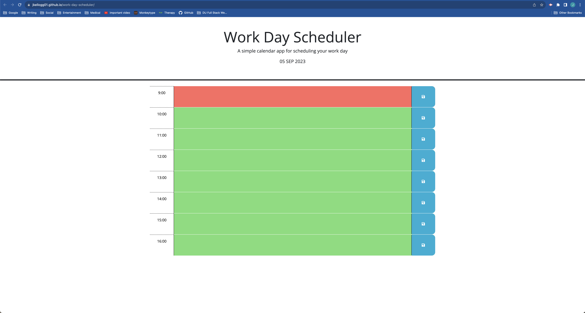

# Workday Scheduling Utility

## Description

The challenge for module 5 was to create a dynamic day planner that will save activities organized by hour and indicate which hours have and have not passed over the course of the day.

## Usage

The deployed page can be found [here](https://jkellogg01.github.io/work-day-scheduler/).

The colored text boxes will allow you to input text.

Clicking the save buttons will save the contents to local storage, and the contents will persist on reload if they have been saved.

## Credit

Starter code was provided for this project. All other code was written by Joshua Kellogg.
